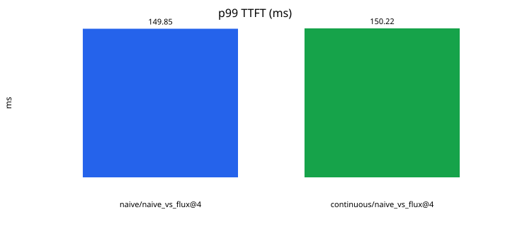
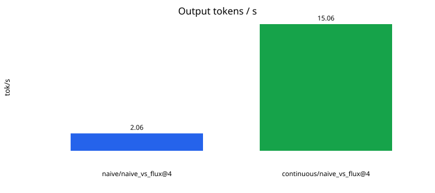
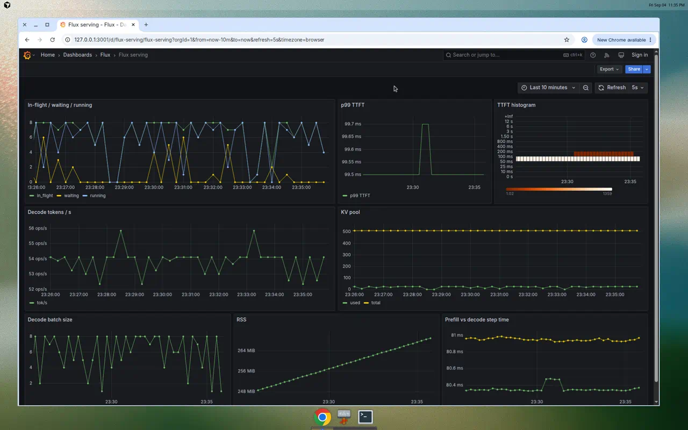

# flux-llm-inference-engine

Production-style LLM inference platform: serving, continuous batching, KV-cache management, streaming generation, and observability.

**Target setup:** Windows laptop, **CPU only**, `Qwen/Qwen2.5-0.5B-Instruct`. Develop in [WSL2](docs/windows-wsl2.md).

The full build plan is in [IMPLEMENTATION_PLAN.md](./IMPLEMENTATION_PLAN.md). This tree implements **Phases 0–9**.

## Status

| Piece | What it does |
|---|---|
| `make hello` | Allocate a 1000×1000 fp32 CPU tensor and print device / RSS / thread facts |
| `GET /health` | Probe + `serve_engine` (`continuous` by default) |
| `GET /admin/stats` | Waiting vs running, last batch size, `kv_blocks_used` |
| `GET /metrics` | Prometheus text (waiting, running, TTFT, tok/s, KV, RSS, batch, prefill/decode) |
| `BlockPool` | Accounting-only KV budget; scheduler admits only what fits |
| `NaiveEngine` | Full-sequence `forward` every token, **no KV cache** — kept as the baseline |
| `CachedEngine` | Prefill once, then decode `[batch, 1]` with a growing KV cache |
| `QueuedWorker` / `ContinuousWorker` | Phase 4 sequential queue vs Phase 5 iteration-level batch |
| `POST /v1/completions` | OpenAI-shaped prompt completions (`stream=true` is SSE) |
| `benchmarks/loadgen.py` | Closed-loop HTTP loadgen; `make bench` writes `docs/benchmark_results.md` |
| Grafana | `make compose-up` → http://127.0.0.1:3001 (admin / `flux`) |

## Quickstart (WSL2 / Linux)

```bash
make install
make test
make api
```

```bash
curl -s http://127.0.0.1:8000/metrics | head
curl -N http://127.0.0.1:8000/v1/completions \
  -H 'content-type: application/json' \
  -d '{"model":"flux-qwen-0.5b","prompt":"The capital of France is","max_tokens":16,"temperature":0,"stream":true}'
```

## Benchmarks (Phase 8)

Closed-loop workers. Drops the first 10 requests as warmup. `naive_vs_flux` runs 3 trials and reports the mean.

```bash
make bench          # Qwen, writes docs/benchmark_results.md + SVG plots
make bench-quick    # FakeLM, CI-safe
```

Re-run `make bench` on the Windows + WSL2 laptop (plugged in) for resume numbers. Do not quote `soak_200` e2e p99 as a latency win.





## Observability (Phase 9)

```bash
make compose-up     # redis + prometheus + grafana
make api            # host :8000 ; Prometheus scrapes host.docker.internal:8000/metrics every 5s
```

Grafana: http://127.0.0.1:3001 — dashboard **Flux serving** (in-flight, TTFT histogram + p99, tok/s, KV pool, batch size, RSS, prefill vs decode). Password `flux`, anonymous Viewer is on.



Serving modes: `continuous` (default), `queued`, `cached`, `naive`. Do not set `uvicorn --workers` above 1.

```bash
make test-integration
```
