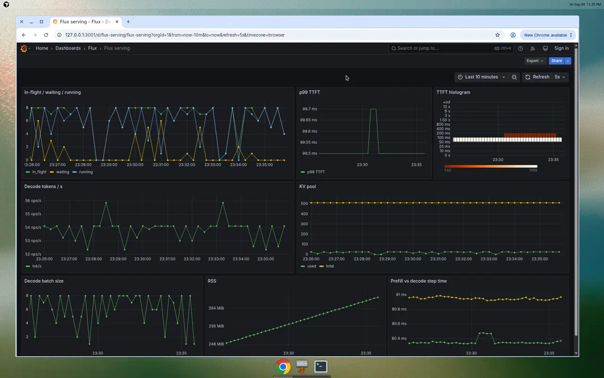

# flux-llm-inference-engine

Production-style LLM inference platform: serving, continuous batching, KV-cache management, streaming generation, and observability.

**Status: complete.** Phases 0–12 are implemented. There is no remaining build phase.

**Target setup:** Windows laptop, **CPU only**, `Qwen/Qwen2.5-0.5B-Instruct`. Develop in [WSL2](docs/windows-wsl2.md).

The architecture record is [IMPLEMENTATION_PLAN.md](./IMPLEMENTATION_PLAN.md). The engine is device-agnostic; this repo is validated on CPU.

Naive serving recomputes the full sequence every token. Flux **prefills** the prompt once into a KV cache, then **decodes** one new token at a time. A **continuous-batching** loop admits new requests at iteration boundaries (decode batch ≤ 8) so the CPU is not stuck on one sequence. A block pool accounts for KV memory and queues work that does not fit. Shared system prompts clone a stored prefix cache so the next prefill only runs the suffix.

> Built Flux, a Python/FastAPI LLM inference server with iteration-level (continuous) batching, KV-cache reuse, and memory-aware request admission. On CPU (Intel Xeon, 4 cores, 15.64 GiB RAM) serving Qwen2.5-0.5B-Instruct in fp32, sustained 200 concurrent in-flight clients (decode batch 4–8) and improved aggregate throughput 7.3x vs. a sequential full-recompute baseline (15.06 vs 2.06 tok/s). p99 TTFT was unchanged (149.9 → 150.2 ms); p99 end-to-end fell from 24.2 s to 3.5 s (6.8x).

## Status

| Piece | What it does |
|---|---|
| `make hello` | Allocate a 1000×1000 fp32 CPU tensor and print device / RSS / thread facts |
| `GET /health` | Probe + `serve_engine` (`continuous` by default) |
| `GET /admin/stats` | Waiting / running ids, last batch size, KV, prefix hits, RSS, tok/s, p50 TTFT |
| `GET /metrics` | Prometheus text |
| Next.js dashboard | Playground, live engine (the interview page), bench table |
| Compose | `api` + `dashboard` + redis + prometheus + grafana |

## One-command demo (WSL2 + Docker Desktop)

```bash
docker compose up --build
```

First run downloads **~1 GB** of Qwen2.5-0.5B-Instruct into the `hf-cache` volume. Then:

| URL | What |
|---|---|
| http://127.0.0.1:3000 | Playground |
| http://127.0.0.1:3000/live | Live engine (batch, KV, queue, RSS) |
| http://127.0.0.1:3000/bench | Last `naive_vs_flux` table |
| http://127.0.0.1:8000/docs | FastAPI |
| http://127.0.0.1:3001 | Grafana (admin / `flux`) |

Compose sets `FLUX_ENABLE_REDIS=true` for IP rate limits and job status (`GET /v1/requests/{id}`). Local `make api` keeps Redis off.

## Local quickstart (no Docker)

```bash
make install
make test
make api
```

In another terminal:

```bash
make dashboard    # Next.js on :3000 → API on :8000
```

```bash
curl -N http://127.0.0.1:8000/v1/chat/completions \
  -H 'content-type: application/json' \
  -d '{"model":"flux-qwen-0.5b","messages":[{"role":"user","content":"Say hi"}],"max_tokens":16,"temperature":0,"stream":true}'
```

## Benchmarks (Phase 8)

```bash
make bench          # Qwen, writes docs/benchmark_results.md + SVG plots
make bench-quick    # FakeLM, CI-safe
```

Published figures live in [docs/benchmark_results.md](./docs/benchmark_results.md). `soak_200` is a FakeLM control-plane check — do not quote its e2e p99 as a Qwen latency win. `make bench` rewrites that doc from a new Qwen run.


## Observability (Phase 9)

Grafana: http://127.0.0.1:3001 — dashboard **Flux serving**. Password `flux`.



Serving modes: `continuous` (default), `queued`, `cached`, `naive`. Do not set `uvicorn --workers` above 1.

Prefix / system-prompt KV reuse (Phase 12) is on by default for queued and continuous serving (`FLUX_ENABLE_PREFIX_CACHE=true`). Identical leading token ids clone a stored prefix cache and prefill only the suffix — the usual playground win is a shared system prompt. Decode still owns a private cache. Admin stats expose `prefix_hits` / `prefix_tokens_saved`.

```bash
make test-integration
```
