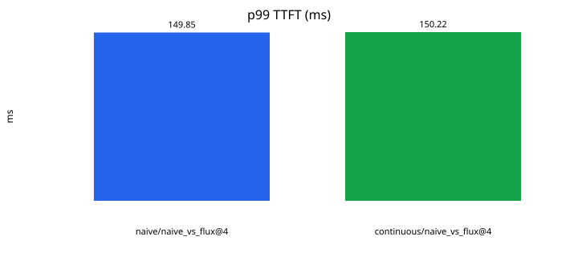
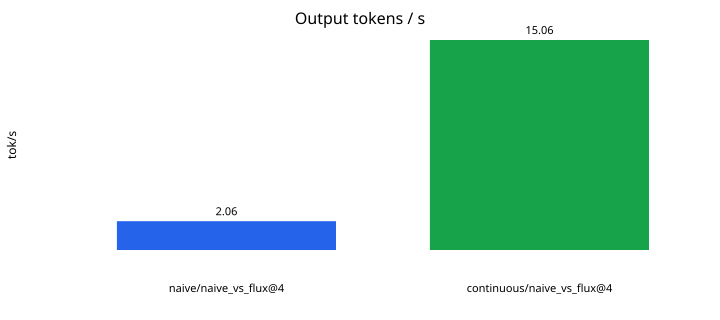

# Flux benchmark results

Phase 8 closed-loop loadgen. These are the **published** figures for this repo: measured on the host that ran `make bench`, not invented.

**Hardware:** linux, Intel(R) Xeon(R) Processor, 4 cores, 15.64 GiB RAM, FLUX_INTRA_THREADS=4, Qwen/Qwen2.5-0.5B-Instruct, fp32 on cpu

`soak_200` is a FakeLM control-plane check (200 in-flight HTTP connections). Do not quote soak e2e or tok/s as a Qwen result.

How to read this:

1. **TTFT / TPOT** — naive (Phase 1) vs Flux continuous (Phase 5) on `long_prompt` or `naive_vs_flux`.
2. **Throughput** — queued vs continuous, or naive vs Flux, at concurrency 4–8.
3. **`soak_200`** — control plane only. Do not quote soak e2e p99 as the latency win.

| Scenario | Engine | Conc | tok/s | req/s | p50 TTFT ms | p99 TTFT ms | p50 e2e ms | p99 e2e ms | statuses |
|---|---|---:|---:|---:|---:|---:|---:|---:|---|
| naive_vs_flux | naive | 4 | 2.065 | 0.065 | 138.2 | 149.9 | 22976.2 | 24157.6 | 200:16 |
| naive_vs_flux | continuous | 4 | 15.064 | 0.471 | 141.1 | 150.2 | 3185.5 | 3531.7 | 200:16 |
| soak_200 | continuous | 200 | 3130.711 | 391.339 | 0.1 | 0.2 | 256.0 | 422.9 | 200:200 |

## Plots

## Resume wording (measured)

Built Flux, a Python/FastAPI LLM inference server with iteration-level (continuous) batching, KV-cache reuse, and memory-aware request admission. On CPU (Intel Xeon, 4 cores, 15.64 GiB RAM) serving Qwen2.5-0.5B-Instruct in fp32, sustained 200 concurrent in-flight clients (decode batch 4–8) and improved aggregate throughput 7.3x vs. a sequential full-recompute baseline (15.06 vs 2.06 tok/s). p99 TTFT was unchanged (149.9 → 150.2 ms); p99 end-to-end fell from 24.2 s to 3.5 s (6.8x).
